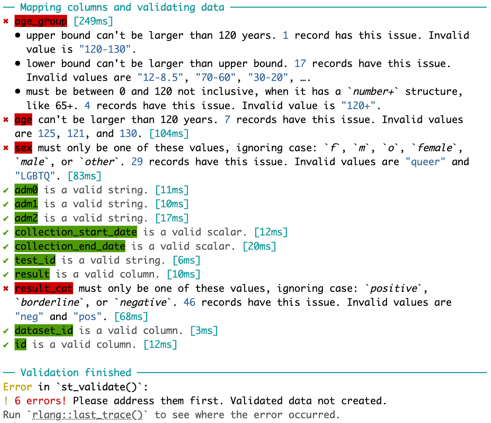
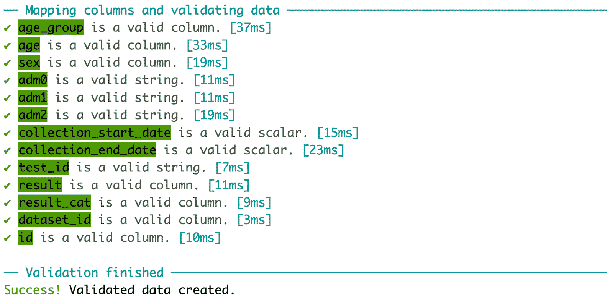

```{r set_options, include = FALSE}
knitr::opts_chunk$set(
  # collapse = TRUE
  comment = "#>"
)
```


***serotrackr*** helps you prepare your raw data for submission to [SeroTracker](https://serotracker.com){target="_blank"}. We will use a sample raw dataset included in the package to demonstrate the workflow of serotrackr:

```{r setup, message=FALSE}
library(serotrackr)
library(dplyr)

head(sample_raw_data)
```

Here are the steps you should follow:

## 1) Validate your data

The first step is to use `st_validate()`. Here, you need to specify which columns in your data contains the data that is required for submission. Instead of unquoted column names, you can also provide a vector of length one for most of the arguments, which would be applied to all records in your data after validation.


```{r st_validate_error, eval=FALSE}
validated_df <- st_validate(
  sample_raw_data,
  dataset_id = dataset_id,
  id = id,
  age_group = age_group,
  age = age,
  sex = sex,
  adm0 = regions$adm0$Canada,
  adm1 = regions$adm1$Canada$Alberta,
  adm2 = regions$adm2$Canada$Alberta$Calgary,
  collection_start_date = "2023-01-01",
  collection_end_date = "2023-02-01",
  test_id = assays$`SARS-CoV-2`$`AAZ LMB - IgG, IgM - COVID-PRESTO®`,
  result = result,
  result_cat = result_cat,
  include_others = TRUE
)
```

```{r, out.width = "700px", echo=FALSE}

```

  
<br>
`st_validate()` produced a detailed report of any errors which need to be addressed before proceeding. To keep things concise, I replace `age_group`, `age`, and `sex` with some correct values and also correct the `result_cat`.

```{r address_issues}
set.seed(4567)
new_raw_data <- sample_raw_data %>%
  dplyr::mutate(
    age_group = rep(c("0-9", "10-19", "20-29", "30-39", "40+"), each=20),
    age = c(sample(0:9, 20, replace=TRUE), sample(10:19, 20, replace=TRUE),
            sample(20:29, 20, replace=TRUE), sample(30:39, 20, replace=TRUE),
            sample(40:120, 20, replace=TRUE)),
    sex = sample(c(rep("f", 40), rep("m", 40), rep("o", 20))),
    result_cat = dplyr::case_when(result_cat == "neg" ~ "negative",
                                  result_cat == "pos" ~ "positive",
                                  TRUE ~ result_cat)
  )
```

Now, let's rerun `st_validate()`:

```{r st_validate_success, message=FALSE, results='hide'}
validated_df <- st_validate(
  new_raw_data,
  dataset_id = dataset_id,
  id = id,
  age_group = age_group,
  age = age,
  sex = sex,
  adm0 = regions$adm0$Canada,
  adm1 = regions$adm1$Canada$Alberta,
  adm2 = regions$adm2$Canada$Alberta$Calgary,
  collection_start_date = "2023-01-01",
  collection_end_date = "2023-02-01",
  test_id = assays$`SARS-CoV-2`$`AAZ LMB - IgG, IgM - COVID-PRESTO®`,
  result = result,
  result_cat = result_cat,
  include_others = TRUE
)
```

```{r, out.width = "700px", echo=FALSE}

```
  
<br>
Hooray! Here is a glimps at the validated data:

```{r print_output}
head(validated_df)
```


## 2) Generate aggregate estimates

Use `st_aggregate()` to generate aggregated estimates:

```{r}
estimates <- st_aggregate(validated_df)
head(estimates)
```


## 3) Export to Excel for submission
The `st_save()` function exports validated data and generated estimates to an Excel document.

```{r, eval=FALSE}
st_save(validated_df, estimates, path = "submission.xlsx")
```

Some fields, mostly metadata, in the exported document will still need to be filled in. The first sheet of the document has the necessary instructions. When you are done, the document is ready to be submitted on [SeroTracker.com](https://serotracker.com){target="_blank"}.
